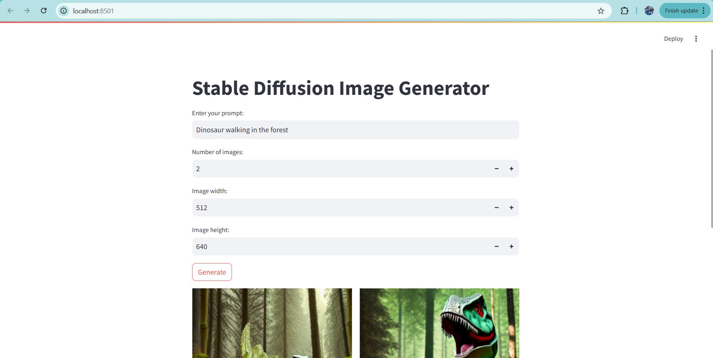
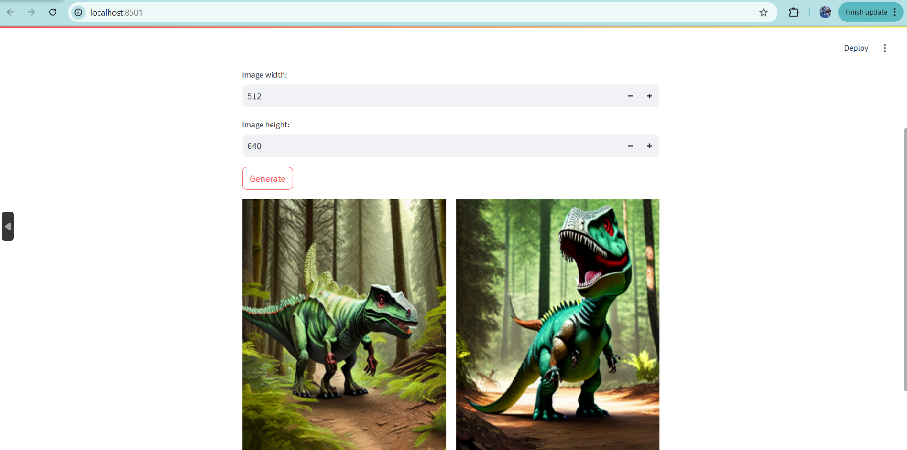

# Text-to-Image-Using-Stable-Diffusion-and-Diffusers
This website allows users to generate AI-generated images from text descriptions using the LLM Stable Diffusion model. Built with Streamlit, the platform provides an interactive and user-friendly experience for creating AI art.

HOW TO WORKS
- Input a text prompt describing the image you want to generate.
- Select the number of images to generate.
- Customize the image size for better resolution and aspect ratio.
- Click "Generate" and wait for the AI to create the image(s).

